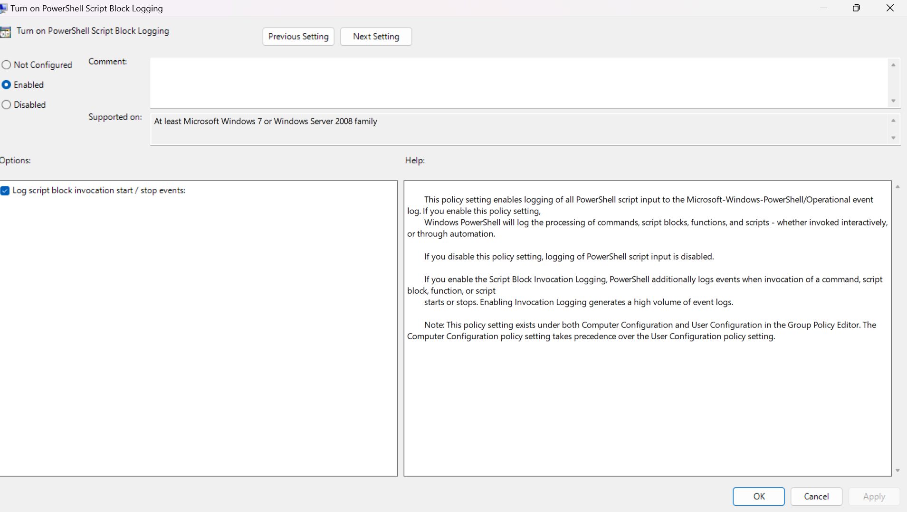

# Suspicious PowerShell Hunt & Telemetry Engineering


## Project Overview

PowerShell remains a primary vector for Living-off-the-Land (LotL) execution, lateral movement, and defense evasion. Adversaries routinely encode payloads or pull tools straight into memory so nothing ever hits disk, easily bypassing standard signature checks.

This project focuses on establishing host-based telemetry, simulating real-world evasion methods, parsing raw event logs to expose de-obfuscated script blocks, and generating automated hunt queries and Sigma detection rules.

> **Key Takeaway:** Standard command-line logging (Event ID 4688) only records what is typed into the shell, such as an unreadable Base64 string. PowerShell Script Block Logging (Event ID 4104) inspects the runtime engine directly, capturing the actual code after it is unpacked in memory.

---

## Technical Stack & Telemetry Setup

| Component | Detail |
| :--- | :--- |
| **Operating System** | Windows 11 Enterprise / Pro |
| **Sensor Mechanism** | Windows PowerShell Script Block Logging (Event ID 4104) |
| **Log Location** | `Applications and Services Logs/Microsoft/Windows/PowerShell/Operational` |
| **Policy Location** | Local Group Policy (`gpedit.msc`) → `Computer Configuration > Administrative Templates > Windows Components > Windows PowerShell` |

### Telemetry Baseline Configuration

To achieve complete visibility, script block logging was enabled along with invocation start/stop tracking via Local Group Policy.

<p align="center">
  
</p>
<p align="center"><em>Figure 1: Local Group Policy configuration enabling Script Block Logging and invocation tracking.</em></p>

---

## Adversary Simulation & MITRE ATT&CK Mapping

| Phase | Technique | MITRE ID | Tradecraft Summary |
| :--- | :--- | :--- | :--- |
| **Execution / Evasion** | Deobfuscate/Decode Files or Information | `T1027` / `T1059.001` | Obfuscated stager using `-EncodedCommand` (Base64) |
| **Ingress Tool Transfer** | Ingress Tool Transfer | `T1105` / `T1059.001` | In-memory web cradle via `.NET WebClient` and `IEX` |

### Simulation 1 — Base64 Obfuscated Execution

A stager passed as an encoded Unicode string, designed to bypass static command-line string matching:

```powershell
powershell.exe -NoProfile -WindowStyle Hidden -EncodedCommand VwByAGkAdABlAC0ASABvAHMAdAAgACIAWwAhAF0AIABNAGEAbABpAGMAaQBvAHUAcwAgAFAAYQB5AGwAbwBhAGQAIABFAHgAZQBjAHUAdABlAGQAIgA=
```

**Telemetry Analysis & Decoded Artifact**

While standard command-line logging registers only the Base64 string, Event ID 4104 intercepts the script block after the engine parses it:

```
Event ID: 4104
Channel: Microsoft-Windows-PowerShell/Operational
Level: Verbose

Creating Scriptblock text (1 of 1):
Write-Host "[!] Malicious Payload Executed"
```

### Simulation 2 — In-Memory Remote Web Cradle

**Threat Scenario**

Threat actors avoid writing files to the file system by staging code directly in memory. Using the `.NET System.Net.WebClient` class paired with `Invoke-Expression` (IEX), remote payloads execute dynamically inside the running process.

**Attack Execution**

```powershell
$wc = New-Object System.Net.WebClient
$payload = "Write-Host '[!] Web Cradle Download Executed Successfully' -ForegroundColor Red"
Invoke-Expression $payload
```

**Telemetry Analysis & Artifact Extraction**

Script Block Logging records both the cradle initialization and the dynamic script executed by `Invoke-Expression`:

```
Event ID: 4104
Channel: Microsoft-Windows-PowerShell/Operational
Level: Verbose

Creating Scriptblock text (1 of 1):
$wc = New-Object System.Net.WebClient; $payload = "Write-Host '[!] Web Cradle Download Executed Successfully' -ForegroundColor Red"; Invoke-Expression $payload
```

---

## Programmatic Threat Hunting

Rather than manually searching through operational events in the Event Viewer GUI, analysts use automated queries to extract suspicious patterns at scale.

**Hunt Query Implementation**

```powershell
Get-WinEvent -FilterHashtable @{LogName='Microsoft-Windows-PowerShell/Operational'; Id=4104} -MaxEvents 100 |
Where-Object {
    $_.Message -match 'Malicious Payload Executed' -or
    $_.Message -match 'WebClient'
} |
Select-Object -First 1 |
Format-List TimeCreated, Id, @{Name='MatchedScriptBlock'; Expression={($_.Message -split "`r?`n")[0..3] -join "`n"}}
```

---

## Detection Engineering: Sigma Rule

To standardize detection across SIEM environments, a vendor-agnostic Sigma rule was developed targeting the indicators observed during both simulations.

```yaml
title: Suspicious PowerShell Staging and Web Cradle Execution
id: 9a2f7411-89bc-4321-9def-0123456789ab
status: experimental
description: Identifies suspicious script blocks indicative of Base64 obfuscation or remote cradle activity.
author: Anjolaoluwa Toriola
logsource:
    product: windows
    service: powershell-operational
detection:
    selection:
        EventID: 4104
        ScriptBlockText|contains:
            - 'Net.WebClient'
            - 'DownloadString'
            - 'Invoke-Expression'
            - '-EncodedCommand'
            - 'FromBase64String'
    condition: selection
falsepositives:
    - Administrative automation scripts
    - Deployment orchestration frameworks (SCCM, Chocolatey)
level: high
tags:
    - attack.execution
    - attack.t1059.001
    - attack.defense_evasion
    - attack.t1027
```

---

## Strategic Recommendations & Defensive Hardening

To protect public sector infrastructure and enterprise environments from living-off-the-land techniques, security programs must move beyond reactive alerting to layered prevention and policy governance.

### What to Implement (Solutions)

- **Enforce Constrained Language Mode (CLM):** Configure PowerShell via AppLocker or Device Guard to operate strictly in Constrained Language Mode for standard endpoints. This restricts dynamic script block execution and neutralizes unauthorized .NET methods such as `System.Net.WebClient` or API reflection calls.
- **Centralize Script Block Telemetry (SIEM Forwarding):** Ingest Windows Event ID 4104 into a centralized security data lake or SIEM. Correlate rapid bursts of 4104 events with external network requests and child process spawning under `powershell.exe` to catch multi-stage intrusions early.
- **Map Security Controls to Governance Frameworks:** Align monitoring controls with NIST SP 800-53 (specifically AU-2 Audit Events and SI-4 Information System Monitoring) and CIS Critical Security Controls (Control 8: Audit Log Management) to maintain audit-ready regulatory compliance across government networks.
- **Mandate Digital Signatures for Admin Workflows:** Deploy an execution policy that only permits cryptographically verified, internally signed scripts to run (`AllSigned`), preventing users from executing unsanctioned scripts pulled from internet repositories.

### What to Avoid (Pitfalls to Prevent)

- **Do Not Rely Solely on Command Line Logging:** Security Event ID 4688 or basic Sysmon Event 1 only sees raw inputs. If an adversary passes a Base64-encoded string or executes entirely within an interactive console, command line auditing is blinded. Script Block Logging (Event ID 4104) is required to see decoded runtime code.
- **Do Not Treat Execution Policies as Security Boundaries:** Setting `Set-ExecutionPolicy Restricted` is an operational safety net to stop accidental clicks, not an adversarial boundary. Attackers routinely bypass execution policies using arguments like `-ExecutionPolicy Bypass` or inline web cradles without triggering alerts.
- **Avoid Flat, Unmonitored PowerShell Permissions:** Never grant domain-wide local administrator rights that permit arbitrary remote PowerShell sessions (WinRM / `Enter-PSSession`) without baseline tracking, credential hygiene, and just-in-time administrative access controls.
